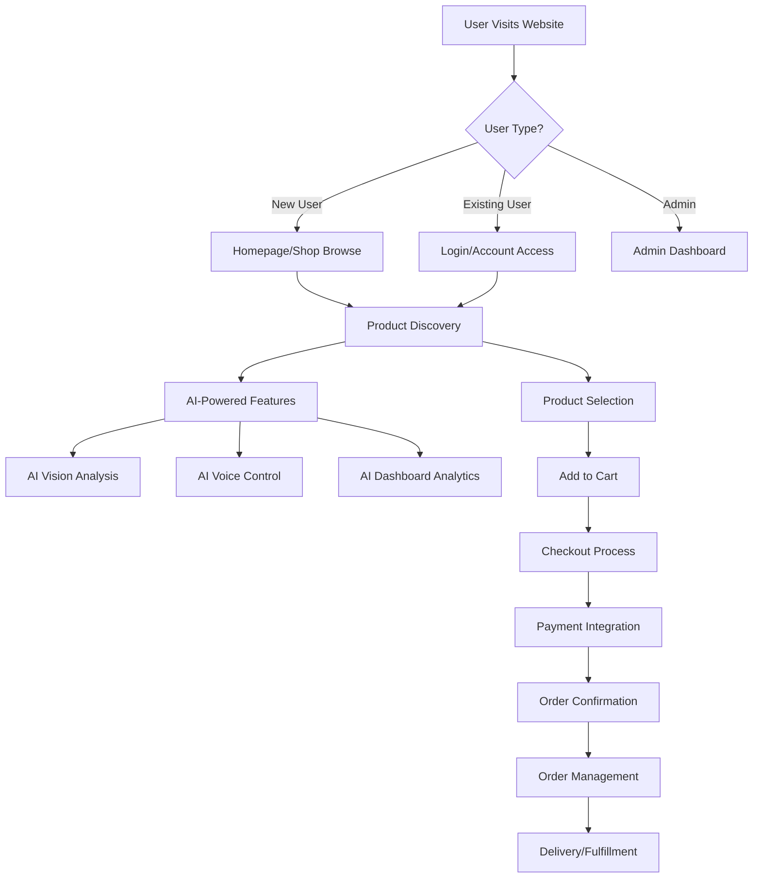

# ESSE Naturals & Nutrition - Workflow Diagram

## प्रोजेक्ट Overview
एक AI-powered e-commerce platform जो natural और nutrition products बेचता है।

```
┌─────────────────────────────────────────────────────────────────────────────────────┐
│                           ESSE NATURALS & NUTRITION                                │
│                         AI-Powered E-commerce Platform                             │
└─────────────────────────────────────────────────────────────────────────────────────┘
```

## 1. User Journey Workflow



## 2. Technical Architecture Workflow

```
┌─────────────────────────────────────────────────────────────────────────────────────┐
│                              FRONTEND LAYER                                        │
├─────────────────────────────────────────────────────────────────────────────────────┤
│ Next.js 15 (App Router) + TypeScript + TailwindCSS                                │
│                                                                                     │
│ ┌─────────────┐ ┌─────────────┐ ┌─────────────┐ ┌─────────────┐                   │
│ │   Pages     │ │ Components  │ │ AI Features │ │   Layout    │                   │
│ │             │ │             │ │             │ │             │                   │
│ │ • Home      │ │ • UI        │ │ • Vision    │ │ • Header    │                   │
│ │ • Shop      │ │ • Product   │ │ • Voice     │ │ • Footer    │                   │
│ │ • Cart      │ │ • Layout    │ │ • Control   │ │ • Nav       │                   │
│ │ • Account   │ │ • AI        │ │ • Dashboard │ │             │                   │
│ │ • Admin     │ │             │ │             │ │             │                   │
│ └─────────────┘ └─────────────┘ └─────────────┘ └─────────────┘                   │
└─────────────────────────────────────────────────────────────────────────────────────┘
                                        │
                                        ▼
┌─────────────────────────────────────────────────────────────────────────────────────┐
│                             BACKEND API LAYER                                      │
├─────────────────────────────────────────────────────────────────────────────────────┤
│ Next.js API Routes (/app/api/)                                                     │
│                                                                                     │
│ ┌─────────────┐ ┌─────────────┐ ┌─────────────┐ ┌─────────────┐                   │
│ │    Auth     │ │  Products   │ │  Payment    │ │   Orders    │                   │
│ │             │ │             │ │             │ │             │                   │
│ │ • Login     │ │ • CRUD      │ │ • Razorpay  │ │ • Create    │                   │
│ │ • Register  │ │ • Search    │ │ • Verify    │ │ • Track     │                   │
│ │             │ │ • Filter    │ │             │ │ • Update    │                   │
│ └─────────────┘ └─────────────┘ └─────────────┘ └─────────────┘                   │
│                                                                                     │
│ ┌─────────────┐ ┌─────────────┐ ┌─────────────┐ ┌─────────────┐                   │
│ │   Users     │ │ Categories  │ │  Analytics  │ │   Health    │                   │
│ │             │ │             │ │             │ │             │                   │
│ │ • Profile   │ │ • CRUD      │ │ • Data      │ │ • Monitor   │                   │
│ │ • Manage    │ │ • Dynamic   │ │ • Reports   │ │ • Status    │                   │
│ └─────────────┘ └─────────────┘ └─────────────┘ └─────────────┘                   │
└─────────────────────────────────────────────────────────────────────────────────────┘
                                        │
                                        ▼
┌─────────────────────────────────────────────────────────────────────────────────────┐
│                           DATABASE & STORAGE LAYER                                 │
├─────────────────────────────────────────────────────────────────────────────────────┤
│ MongoDB                                                                             │
│                                                                                     │
│ ┌─────────────┐ ┌─────────────┐ ┌─────────────┐ ┌─────────────┐                   │
│ │   Users     │ │  Products   │ │   Orders    │ │ Categories  │                   │
│ │ Collection  │ │ Collection  │ │ Collection  │ │ Collection  │                   │
│ └─────────────┘ └─────────────┘ └─────────────┘ └─────────────┘                   │
└─────────────────────────────────────────────────────────────────────────────────────┘
```

## 3. AI Features Workflow

```
┌─────────────────────────────────────────────────────────────────────────────────────┐
│                              AI INTEGRATION                                        │
├─────────────────────────────────────────────────────────────────────────────────────┤
│                                                                                     │
│ ┌─────────────┐     ┌─────────────┐     ┌─────────────┐     ┌─────────────┐       │
│ │ AI Vision   │────▶│ AI Voice    │────▶│ AI Control  │────▶│AI Dashboard │       │
│ │             │     │             │     │             │     │             │       │
│ │ • Face-API  │     │ • Speech    │     │ • OpenAI    │     │ • Analytics │       │
│ │ • TensorFlow│     │ • Recognition│     │ • ML5.js    │     │ • Reports   │       │
│ │ • Webcam    │     │ • Voice UI  │     │ • Smart     │     │ • Charts    │       │
│ │ • Analysis  │     │             │     │   Control   │     │             │       │
│ └─────────────┘     └─────────────┘     └─────────────┘     └─────────────┘       │
└─────────────────────────────────────────────────────────────────────────────────────┘
```

## 4. State Management Workflow

```
┌─────────────────────────────────────────────────────────────────────────────────────┐
│                            STATE MANAGEMENT                                        │
├─────────────────────────────────────────────────────────────────────────────────────┤
│ Zustand Store                                                                       │
│                                                                                     │
│ ┌─────────────┐     ┌─────────────┐     ┌─────────────┐                           │
│ │ Cart State  │────▶│ User State  │────▶│Local Storage│                           │
│ │             │     │             │     │             │                           │
│ │ • Items     │     │ • Auth      │     │ • Cart      │                           │
│ │ • Quantity  │     │ • Profile   │     │ • User      │                           │
│ │ • Total     │     │ • Settings  │     │ • Prefs     │                           │
│ └─────────────┘     └─────────────┘     └─────────────┘                           │
└─────────────────────────────────────────────────────────────────────────────────────┘
```

## 5. E-commerce Flow Workflow

```
User Journey:
┌─────────────┐    ┌─────────────┐    ┌─────────────┐    ┌─────────────┐
│   Browse    │───▶│   Search    │───▶│   Filter    │───▶│   Select    │
│  Products   │    │  Products   │    │  Products   │    │  Product    │
└─────────────┘    └─────────────┘    └─────────────┘    └─────────────┘
        │                                                        │
        ▼                                                        ▼
┌─────────────┐    ┌─────────────┐    ┌─────────────┐    ┌─────────────┐
│    Cart     │◀───│   Review    │◀───│  Add to     │◀───│   Product   │
│ Management  │    │    Cart     │    │    Cart     │    │   Details   │
└─────────────┘    └─────────────┘    └─────────────┘    └─────────────┘
        │
        ▼
┌─────────────┐    ┌─────────────┐    ┌─────────────┐    ┌─────────────┐
│  Checkout   │───▶│   Payment   │───▶│Order Confirm│───▶│   Order     │
│   Process   │    │(Razorpay)   │    │             │    │ Management  │
└─────────────┘    └─────────────┘    └─────────────┘    └─────────────┘
```

## 6. Admin Workflow

```
┌─────────────────────────────────────────────────────────────────────────────────────┐
│                              ADMIN DASHBOARD                                       │
├─────────────────────────────────────────────────────────────────────────────────────┤
│                                                                                     │
│ ┌─────────────┐    ┌─────────────┐    ┌─────────────┐    ┌─────────────┐           │
│ │   Product   │───▶│   Order     │───▶│    User     │───▶│  Analytics  │           │
│ │ Management  │    │ Management  │    │ Management  │    │  & Reports  │           │
│ │             │    │             │    │             │    │             │           │
│ │ • Add/Edit  │    │ • Track     │    │ • View      │    │ • Sales     │           │
│ │ • Delete    │    │ • Update    │    │ • Manage    │    │ • Traffic   │           │
│ │ • Images    │    │ • Status    │    │ • Roles     │    │ • Revenue   │           │
│ └─────────────┘    └─────────────┘    └─────────────┘    └─────────────┘           │
└─────────────────────────────────────────────────────────────────────────────────────┘
```

## 7. Development Workflow

```
Development Process:
┌─────────────┐    ┌─────────────┐    ┌─────────────┐    ┌─────────────┐
│Local Setup  │───▶│Development  │───▶│    Build    │───▶│  Production │
│             │    │             │    │             │    │             │
│ npm i       │    │ npm run dev │    │ npm run     │    │ npm start   │
│             │    │ Port: 3005  │    │ build       │    │             │
└─────────────┘    └─────────────┘    └─────────────┘    └─────────────┘
        │                                                        │
        ▼                                                        ▼
┌─────────────┐    ┌─────────────┐                     ┌─────────────┐
│    Seed     │    │    Lint     │                     │   Deploy    │
│   Database  │    │   & Format  │                     │             │
│             │    │             │                     │             │
│ npm run seed│    │ npm run lint│                     │             │
└─────────────┘    └─────────────┘                     └─────────────┘
```

## 8. API Endpoints Structure

```
/api/
├── auth/
│   ├── login
│   └── register
├── products/
│   ├── [id] (GET, PUT, DELETE)
│   └── search
├── categories/
│   └── [slug]
├── orders/
│   ├── create
│   └── track
├── payment/
│   ├── create-order
│   └── verify
├── users/
│   └── profile
├── analytics/
│   └── dashboard
├── images/
│   └── upload
├── health/
│   └── check
└── contact/
    └── form
```

## Key Features:
- 🛒 **E-commerce**: Complete shopping cart और checkout
- 🤖 **AI Integration**: Vision, Voice, और Smart Control
- 📱 **Responsive**: Mobile-first design
- 💳 **Payment**: Razorpay integration
- 🔐 **Authentication**: User login/register
- 📊 **Analytics**: Admin dashboard और reports
- 🗄️ **Database**: MongoDB के साथ data management
- 🎨 **UI/UX**: TailwindCSS और shadcn components

## Technologies Used:
- **Frontend**: Next.js 15, React, TypeScript, TailwindCSS
- **Backend**: Next.js API Routes, MongoDB
- **AI/ML**: TensorFlow.js, Face-API.js, OpenAI, ML5.js
- **Payment**: Razorpay
- **State**: Zustand
- **UI**: Radix UI, Framer Motion
- **Charts**: Chart.js, Recharts
